# BST Fitness

## 목차
>1. 기획의도
>2. 팀원구성
>3. 개발환경
>4. 기술구현 내용
>5. DB ERD
>6. 페이지 소개
>
>     * 로그인
>
>     * 회원가입
>
>     * 메인
>
>     * 트레이너 소개
>
>     * 트레이너 리뷰
>
>     * 회원권 등록
>
>     * PT 예약하기
>
>     * Q&A
>
>     * My Page(Member)
>
>     * My Page(Trainer)
>7. 성과

# 1. 기획의도

* 현재 수면 위에 올라온 헬스장 정찰제 이슈에 맞춰 정찰제를 통한 멤버쉽/PT 가격을 소비자에게 제공하므로써 소비자로 하여금 정당한 가격선택의 기회를 제공하고 추가로 인터넷을 통한 PT스케쥴 예약기능을 통해 소비자로 하여금 보다 자유로운 스케쥴 관리를 가능하게 하기 위하여 'BST Fitness'라는 헬스장 웹페이지 프로젝트를 기획하게 되었다.

# 2. 팀원구성

* 김리영
* 곽헌섭
* 전준호
* 천웅재

# 3. 개발환경

* Front-end : javascript / jsp / jquery/ bootstrap
* Back-end : java / spring
* DB : oracle
* OS : windows 10

# 4. 기술 구현 내용

* 멤버쉽 / PT 결제
* PT 스케쥴 예약
* 트레이너 리스트 및 트레이너 리뷰
* Q&A 게시판
* 마이 페이지

# 5. DB ERD

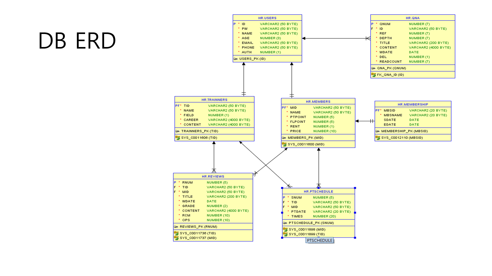

# 6. 페이지 소개

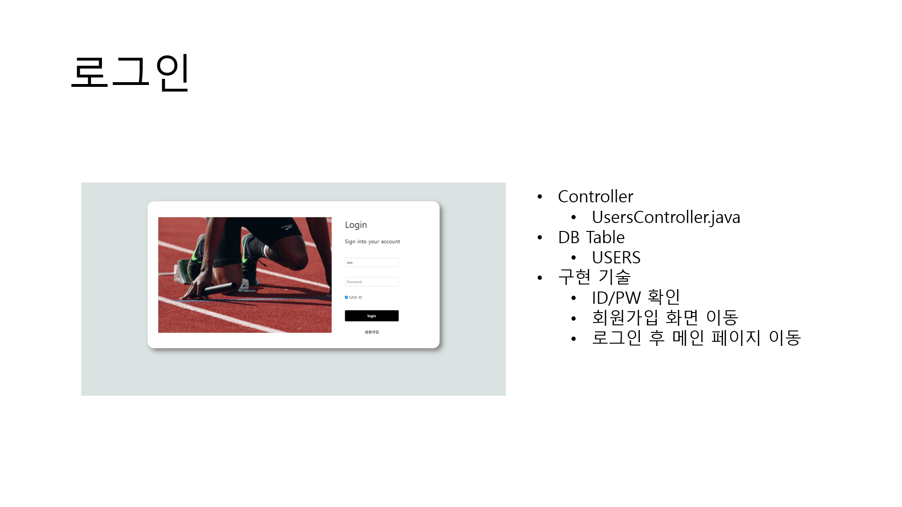

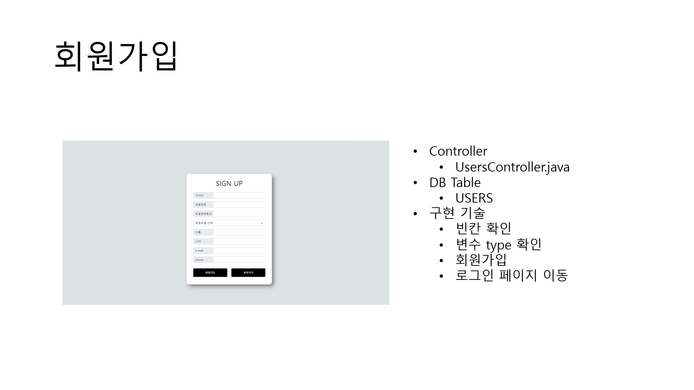

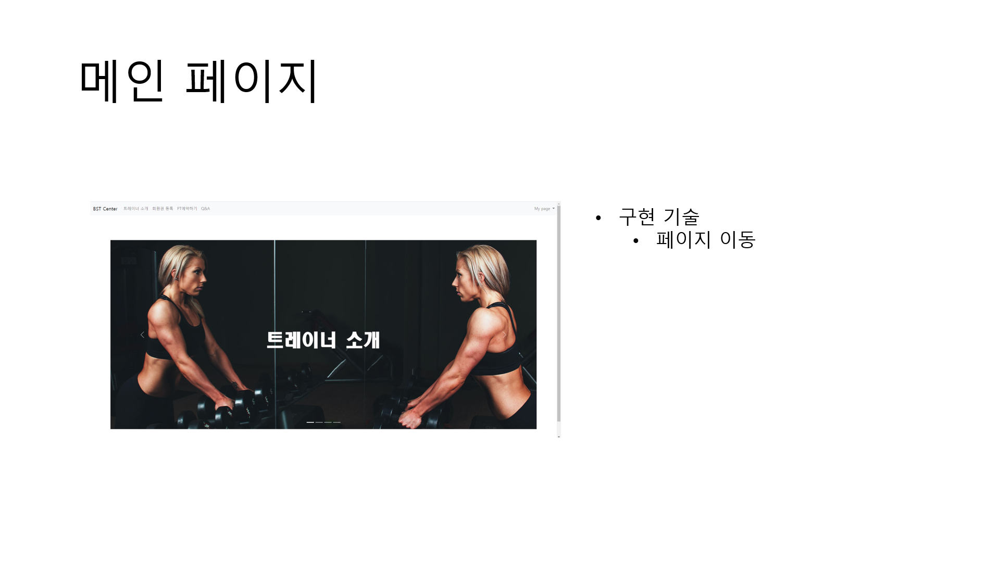

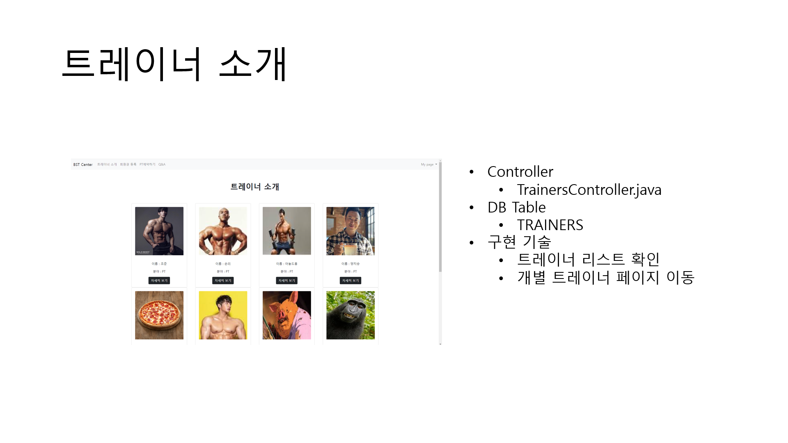

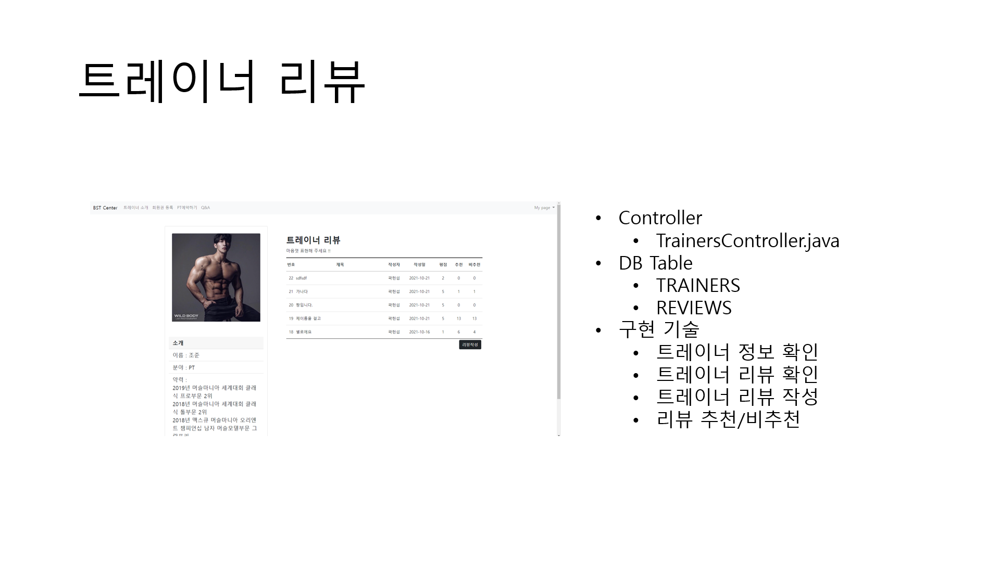

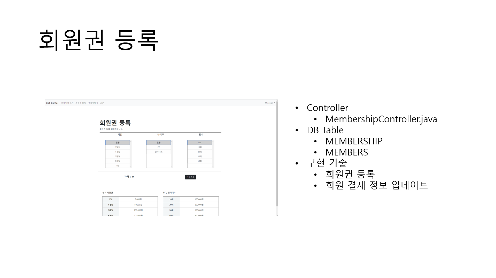

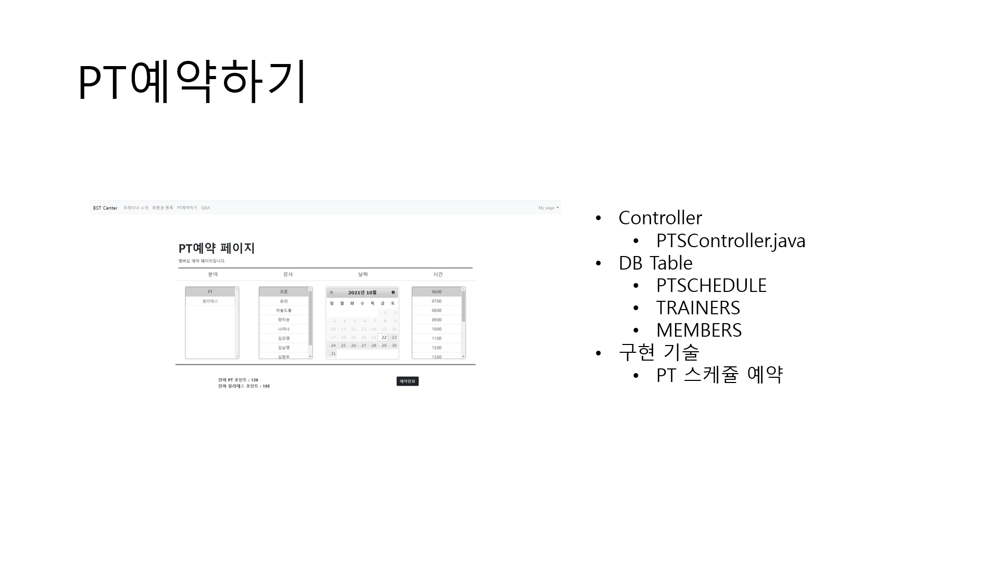

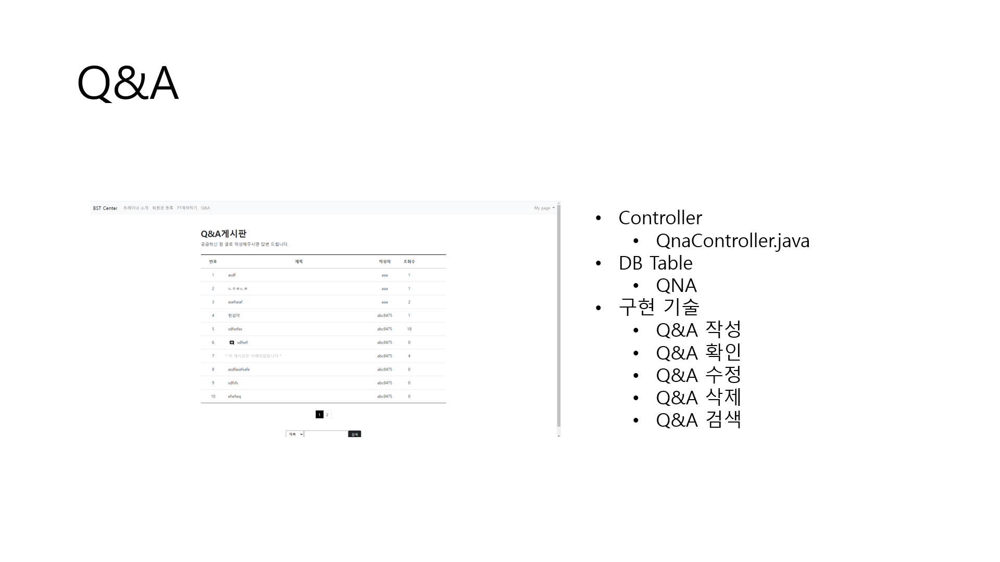

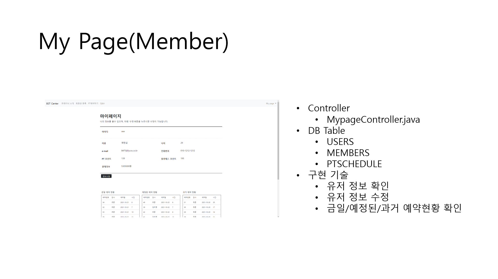

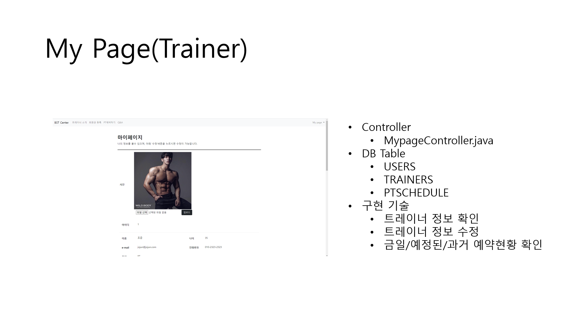

# 7. 성과

* 팀장을 제외한 모든 인원이 비전공자 였기 때문에 처음으로 진행하는 프로젝트였기 때문에 굉장히 많은 어려움이 있었다. Spring setting의 경우 강사님이 그동안 진행한 수업을 기반으로 설정하였다. 전공자 출신이었던 리영이의 도움으로 DB구조를 설계할 수 있었다.
* 아직 JAVA어법도 익숙치 않아 처음에는 팀장에게 아주 기초적인 것부터 질문했었다. 그러나 시간이 지나면서 DB에서 간단한 데이터만 가지고 오는 것부터 시작해서 천천히 MVC모델에 익숙해 질 수 있었다.
* 아쉬웠던 부분은 나는 소속 트레이너의 리스트를 화면에 뛰우는 것과 PT예약 시스템을 구현했는데, 5일 이내에 완벽하게 구현하기는 불가능 했다. 그래서 팀장의 도움을 받아 많은 부분을 완성했다. 실력이 부족했지만 후반에는 거의 javascript와 css,html을 활용해 front부분에서 팀장이 시간을 아낄 수 있도록 최선을 다해 작업했다.
* 가장 큰 성과는 팀원들과 협동을 통해서 무언가를 이루어냈다는 점이라고 생각한다. 대부분의 팀원들이 비전공자였기 때문에 진행에 많은 어려움을 겪었지만 모든 팀원들이 각자의 역할에 최선을 다했고, 미흡했지만 결과물을 만들어냈다는 점이 만족스러웠다. 특히, 나의 끊임없는 질문에도 끝까지 친절히 답변하고 도와준 팀장에게 박수를 보낸다.
